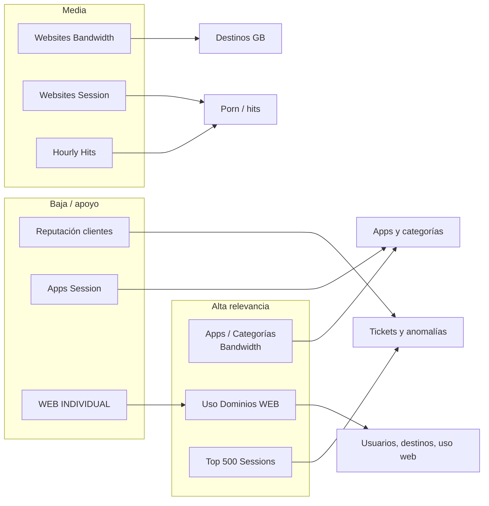

# Canvas de relevancia — PDFs Fortinet (3–9 ago 2026)

Tablero para el informe UTM 64046. Criterio: **cuánto aportó cada PDF a responder las 5 preguntas + tickets**.

---

## Mapa rápido

---

## Ranking

| # | Relevancia | PDF | Para qué sirvió | Si faltara |
|---|---|---|---|---|
| 1 | **Crítico** | `Top 20 Categorías y Aplicaciones (Uso Ancho de Banda) INDIVIDUAL` | Apps y categorías en GB/% (QUIC, WhatsApp, Update, VPN, AnyDesk) | No se podrían contestar bien las 2 primeras preguntas |
| 2 | **Crítico** | `Reporte Uso Dominios WEB` | Usuarios top, destinos, categorías web, bloqueos, uso web | Quedarían huecos en usuarios, destinos y sección web |
| 3 | **Crítico** | `Top 500 Sessions by Bandwidth` | Quién hizo qué: COM-TRIAGE01/porn, radios, Drive, sesiones de 24 h | Se verían GB, no responsables |
| 4 | **Alta** | `Top 20 Category and Websites (Bandwidth)` | Destino → empresa/dominio en GB (WhatsApp CDN, Microsoft, radios, zcqrlzysc) | Destinos más débiles |
| 5 | **Alta** | `Top 20 Category and Websites (Session)` | Pornography #2 por sesiones; 2.1M hits a `zcqrlzysc.com` | Menos evidencia de abuso web |
| 6 | **Media** | `Hourly Website Hits` | Picos horarios de pornografía (p. ej. 15:00 = 44% de hits) | Se pierde el “cuándo”, no el “qué” |
| 7 | **Media-baja** | `Reputación de Clientes INDIVIDUAL` | Score de COM-TRIAGE01 y lista de peores reputaciones | Tickets más flojos; no aporta GB |
| 8 | **Baja** | `Top 20 Categories and Applications (Session)` | Muchas sesiones Unknown/DNS; no mide consumo real | Casi no cambia el informe de bandwidth |
| 9 | **Baja / duplicado** | `Reporte Uso Dominios WEB INDIVIDUAL` | Misma estructura que el #2; filtro extra (`deviceip`) | Redundante si ya está el WEB general |

---

## Qué PDF responde cada pregunta

| Pregunta del informe | PDFs que más aportan | PDFs que casi no aportan |
|---|---|---|
| Apps de mayor consumo y por qué | **#1 Bandwidth apps** | WEB individual, Hourly, Reputación |
| Categorías de mayor consumo y por qué | **#1** + #2/#4 (vista web) | Apps Session, Reputación |
| Usuarios de mayor consumo y por qué | **#2 WEB** + **#3 Top 500** | Apps Session, Hourly (no trae usuario) |
| Destinos / empresa / qué bloquear | **#4 Websites BW** + **#2** + **#3** | Apps Session, Reputación |
| Qué se observa en uso web | **#2** + #5 + #6 | Apps Bandwidth (poco web-filter) |
| Tickets / anomalías | **#3** + #2 (Most Blocked) + #7 | WEB Individual |

---

## Tarjetas

### Críticos (usar siempre)

**1. Top 20 Categorías y Aplicaciones (Bandwidth) INDIVIDUAL**  
Fuente de verdad de Application Control: 2.49 TB, Network Service 35%, Collaboration/WhatsApp, Update, Proxy/VPN, AnyDesk.

**2. Reporte Uso Dominios WEB**  
Fuente de verdad de Web Filter: top users (`192.168.9.254` 59.55 GB), destinos, Most Blocked (COM-TRIAGE01 2.1M).

**3. Top 500 Sessions by Bandwidth**  
Fuente de verdad forense: amarra usuario + sitio + hora + GB (porn, radio, Drive).

### Apoyo fuerte

**4–5. Category and Websites (Bandwidth / Session)**  
Cruzan categoría Fortinet ↔ dominio. Bandwidth para bloquear por consumo; Session para detectar ruido/abuso (porn, apkpure).

**6. Hourly Website Hits**  
105 páginas, muy ruidoso, pero confirma que el pico de `zcqrlzysc.com` no fue un instante: se repite en varias horas.

### Menos relevantes (no priorizar la próxima semana)

**7. Reputación de Clientes INDIVIDUAL**  
Útil solo para priorizar tickets. Gráficas poco legibles; filtro a `192.168.2.218`.

**8. Categories and Applications (Session)**  
Sesiones ≠ consumo. Infla Unknown (`tcp/7680`) y no explica GB.

**9. Uso Dominios WEB INDIVIDUAL**  
Duplicado del reporte WEB general. Conservar solo si se necesita el recorte por dispositivo.

---

## Recomendación para el próximo corte semanal

**Pedir / abrir primero (mínimo viable):**  
1. Top 20 Categorías y Aplicaciones — Bandwidth  
2. Reporte Uso Dominios WEB (el general, no el individual)  
3. Top 500 Sessions by Bandwidth  

**Abrir después si hay anomalía:**  
4. Category and Websites Bandwidth + Session  
5. Hourly Hits (solo si hay un dominio sospechoso)  
6. Reputación (solo para armar tickets)

**Se pueden omitir si hay poco tiempo:**  
- WEB INDIVIDUAL  
- Categories and Applications (Session)
